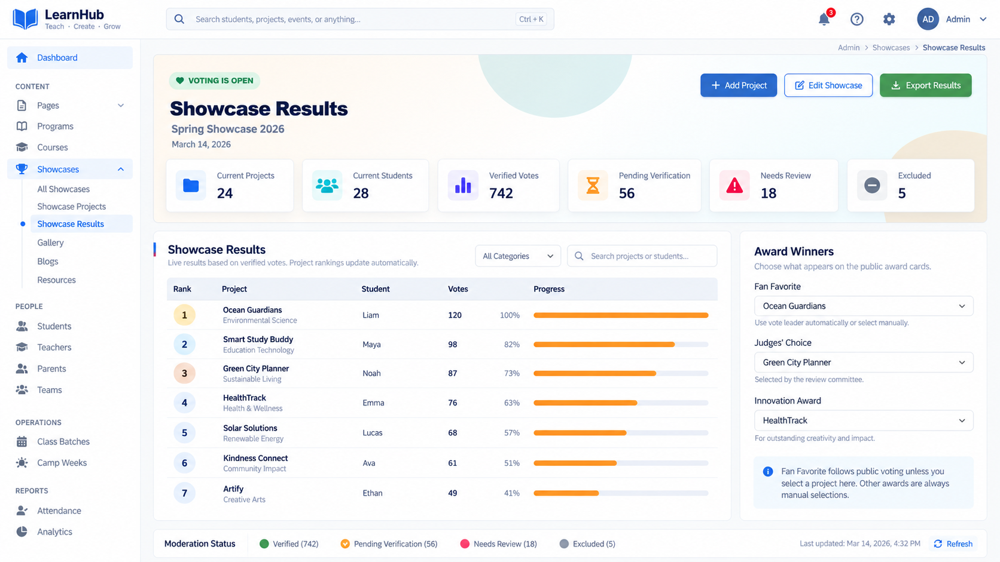
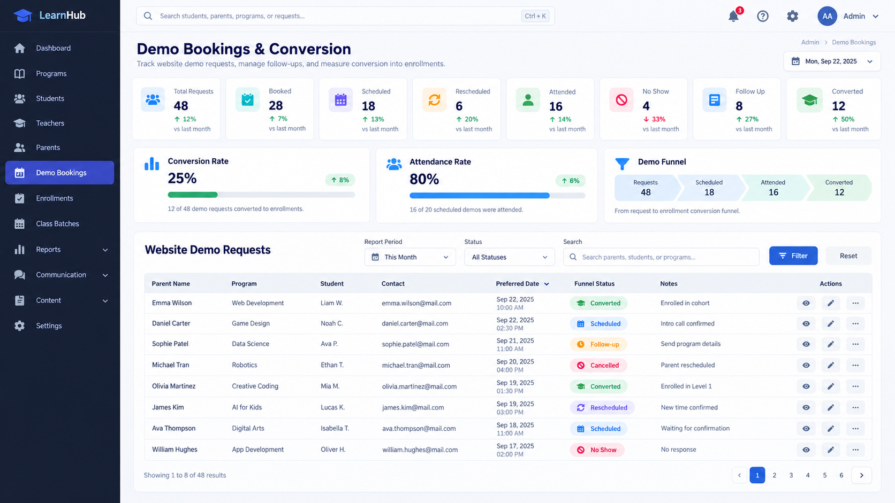
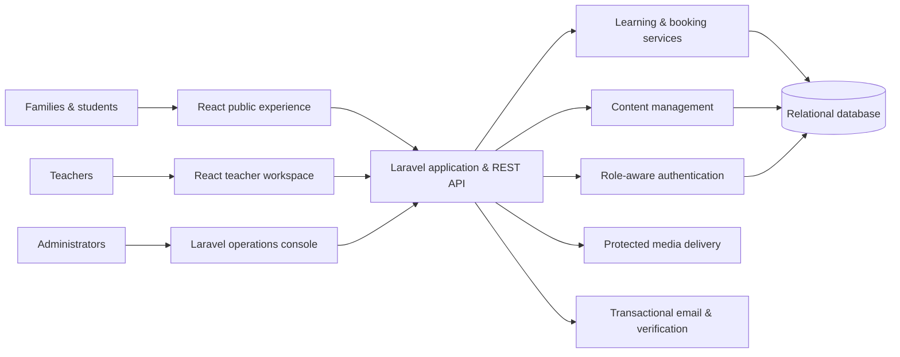
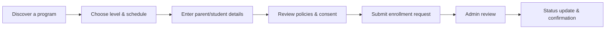
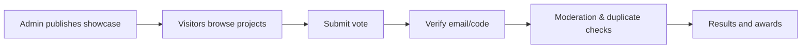

<p align="center">
  
</p>

<h1 align="center">CodeBloom Learning Platform</h1>

<p align="center">
  A full-stack learning operations platform for course discovery, enrollment,<br />
  instructor workflows, content management, and student showcases.
</p>

<p align="center">
  
  
  
  
  
</p>

> **Portfolio note:** This repository documents a private client delivery. The product name, people, organizations, content, and interface examples are anonymized. Production source code, credentials, customer data, and proprietary assets are intentionally not published.

## Project overview

CodeBloom is a multi-role education platform that brings a public marketing website and day-to-day learning operations into one system. Families can explore programs, reserve classes and camps, manage student-related requests, and participate in verified project showcases. Teachers receive a focused workspace for classes, attendance, notes, and progress. Administrators manage the complete content and operational lifecycle.

The implementation combines a Laravel application and API layer with React experiences for the public website and teacher workspace. Server-rendered admin screens support data-heavy operational work, while protected media delivery, throttled submissions, verification flows, and role-specific access address the platform's privacy and abuse-prevention needs.

## My contribution

- Full-stack application architecture and feature delivery
- Responsive public website and reusable React UI
- Parent registration, login, verification, and service-request workflows
- Teacher dashboard for class operations and student progress
- Admin CMS and operations tools across programs, bookings, users, and content
- Student project showcases with verified voting and moderation
- API design, validation, access control, protected media, and SEO support
- Automated feature and unit test coverage for critical workflows

## Product areas

| Experience | Representative capabilities |
| --- | --- |
| Public website | Dynamic landing pages, programs, class schedules, instructors, events, gallery, FAQs, articles, and SEO metadata |
| Enrollment | Course and level discovery, available class selection, student details, consent capture, and inquiry submission |
| Teacher workspace | Assigned classes, attendance, notes, progress updates, and batch operations |
| Student showcase | Project galleries, protected video, QR entry points, verified voting, moderation, results, and awards |
| Camp booking | Session selection, cart, multi-step registration, confirmation reference, and back-office status management |
| Administration | Courses, batches, teachers, students, enrollments, bookings, content, gallery, articles, FAQs, and inquiries |

## Representative interfaces

These visuals are privacy-safe reconstructions based on your production screen references. They preserve the senior product patterns—dense operations navigation, KPI reporting, funnel analytics, filters, status workflows, moderation, and exports—while using fictional branding, names, dates, and records.

### Operations dashboard

[](assets/screenshots/05-operations-dashboard.png)

The dashboard brings together program, student, teacher, content, parent-registration, and demo-funnel signals so staff can move from a KPI to the underlying workflow quickly.

### Showcase moderation and results

[](assets/screenshots/06-showcase-results.png)

The showcase workflow combines verified votes, moderation states, ranked projects, progress indicators, award selection, and export-ready results.

### Demo-booking conversion workflow

[](assets/screenshots/07-demo-bookings-conversion.png)

The booking view models a real operational funnel: request, booked, scheduled, attended, follow-up, conversion, no-show, and cancellation states with filtering and next actions.

Additional lightweight flow mockups remain in `assets/screenshots/` as optional supporting visuals.

## System at a glance



More detail: [architecture](docs/ARCHITECTURE.md) · [user flows](docs/USER-FLOWS.md) · [screenshot guide](docs/SCREENSHOT-GUIDE.md)

## Core workflows





## Engineering highlights

- **Hybrid delivery:** React powers interactive customer and teacher journeys; Laravel Blade supports efficient, data-dense administration.
- **API-backed content:** Courses, pages, instructors, projects, workshops, FAQs, and articles are centrally managed and delivered to the public experience.
- **Workflow integrity:** Rate limiting, server-side validation, verification codes, moderation states, and protected media routes guard high-risk actions.
- **Operational depth:** Attendance, class notes, student progress, enrollment status, demo bookings, and camp registrations share a consistent administrative model.
- **Discoverability:** Dynamic metadata, XML sitemap support, robots configuration, semantic pages, and stable public URLs support technical SEO.
- **Maintainability:** Feature tests cover business-critical paths; UI logic is organized into reusable React components, hooks, and utilities.

## Technology

| Layer | Tools |
| --- | --- |
| Backend | PHP 8.2+, Laravel 12, Eloquent ORM, Blade |
| Frontend | React 19, React Router, TypeScript, Tailwind CSS 4, Vite |
| Data & services | Relational database, file/media storage, queues, transactional email |
| Quality | PHPUnit, Vitest, Testing Library, static type checking |
| Delivery | Environment-based configuration, optimized production builds, deployment-specific public roots |

## Skills demonstrated

| Skill area | Applied in this delivery |
| --- | --- |
| Laravel / PHP | Laravel 12 application structure, controllers, middleware, policies, Blade admin screens, validation, jobs, mail, and deployment configuration |
| React engineering | React 19 public and teacher portals, React Router route composition, reusable components, hooks, protected routes, forms, loading states, and error states |
| Database design | Eloquent models, migrations, relationships, status-driven records, schedule/batch modeling, booking and enrollment history, showcase ballots, and operational reporting queries |
| REST API development | Domain-oriented endpoints for content, enrollment, teacher operations, camp bookings, projects, showcases, and public submissions |
| Email workflows | Verification codes, password reset, teacher credentials, enrollment updates, booking follow-ups, review requests, and showcase vote verification emails |
| Authentication & authorization | Separate admin and teacher access boundaries with protected portal routes and role-appropriate actions |
| Admin dashboards | KPI cards, conversion funnels, search/filter controls, paginated tables, status badges, action menus, exports, moderation queues, and award configuration |
| Security engineering | Request validation, throttling on abuse-prone endpoints, protected project media, verification gates, publish states, and privacy-aware data handling |
| Testing | PHPUnit feature/unit tests plus Vitest and Testing Library coverage for critical workflow and UI behavior |
| SEO & content systems | Dynamic page content, editable policies, metadata, canonical public routes, sitemap/robots support, articles, blogs, FAQs, and gallery management |
| Frontend delivery | Vite builds, TypeScript checks, responsive layouts, asset strategy, and environment-specific public entry points |

## Quality and security approach

- Server-side request validation and explicit resource authorization
- Dedicated admin and teacher authentication boundaries
- Throttling on authentication, voting, enrollment, and public submission endpoints
- Email/code verification for identity-sensitive workflows
- Protected delivery for student project media
- Moderation and audit-friendly status transitions
- Automated tests around enrollment, portals, bookings, content, and showcase voting
- Secrets and client data excluded from this public repository

## Repository contents

```text
codebloom-learning-platform/
├── assets/
│   ├── cover.svg
│   └── screenshots/        # Sanitized representative visuals only
├── docs/
│   ├── ARCHITECTURE.md
│   ├── SCREENSHOT-GUIDE.md
│   └── USER-FLOWS.md
├── .gitignore
├── README.md
└── SECURITY.md
```

## Why the source is private

The production application contains client-owned business rules, brand assets, deployment details, and privacy-sensitive education workflows. Publishing a curated case study demonstrates the engineering scope while respecting confidentiality and safeguarding users. A guided technical walkthrough can be discussed privately when appropriate and authorized.

---

<p align="center"><strong>Available for similar Laravel, React, portal, booking, CMS, and workflow automation projects through Upwork.</strong></p>
# codebloom-learning-platform

"# codebloom-learning-platform" 
