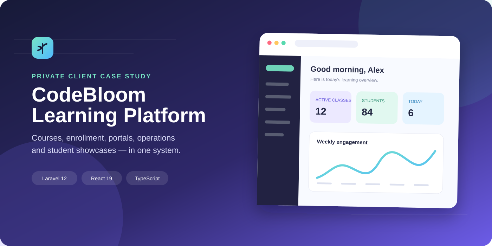
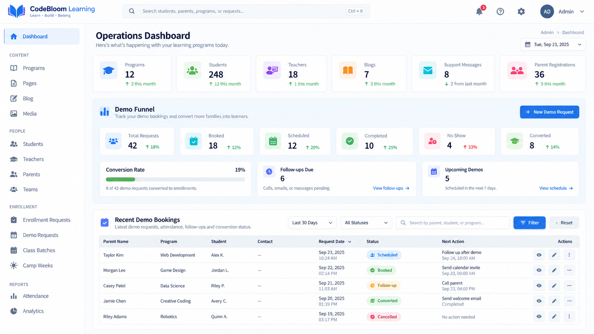
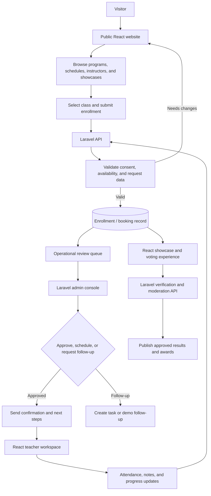
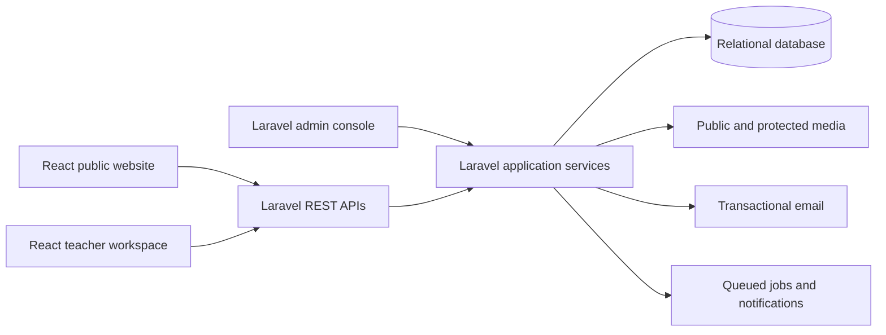

# CodeBloom Learning Platform

> An anonymized case study for a production-grade education operations platform.

## Overview

CodeBloom combines a public React learning website, a React teacher workspace, Laravel APIs, and a Laravel administrative console. The platform supports program discovery, enrollment, scheduling, demo-booking conversion, content management, student showcases, verified voting, moderation, and operational reporting.

This public repository is a privacy-safe portfolio case study. The production source, client identity, credentials, customer records, and proprietary media remain private.

## My role

Full-stack architecture and delivery across the React public experience, React teacher workspace, Laravel APIs, Laravel admin console, database workflows, email automation, security controls, and automated tests.

## Product surface

| Area | Delivered capability |
| --- | --- |
| Public experience | Programs, schedules, instructors, workshops, articles, FAQs, gallery, SEO metadata |
| Enrollment | Course selection, class availability, student details, consent, review queue |
| Teacher workspace | Assigned classes, attendance, notes, progress updates, batch operations |
| Demo operations | Request intake, booking states, follow-ups, attendance, conversion analytics |
| Student showcase | Project galleries, protected video, QR entry points, verified voting, moderation, awards |
| Administration | Courses, batches, teachers, students, bookings, content, inquiries, exports |

## Production-style admin screens

These are anonymized reconstructions based on the supplied production screen references. They preserve the information architecture and workflow density while replacing the original identity and data.

### Operations dashboard

KPI cards, global search, funnel metrics, follow-up queues, and recent demo requests give staff a direct path from summary insight to action.

### Showcase results and moderation

[Open the showcase results reconstruction](assets/screenshots/06-showcase-results.png)

Verified votes, moderation states, ranked projects, award controls, and export-ready results are presented in one workflow.

### Demo-booking conversion

The demo-booking conversion capture is intentionally excluded from this public package until every contact value is replaced with a clearly fictional placeholder.

The workflow tracks requests through booked, scheduled, attended, follow-up, converted, cancelled, and no-show states.

## Technical skills demonstrated

| Skill | Evidence in the delivery |
| --- | --- |
| Laravel / PHP | Controllers, middleware, policies, Blade admin screens, validation, jobs, mail, and deployment configuration |
| React | React 19 portals, route composition, reusable components, hooks, protected routes, forms, and stateful workflows |
| Database engineering | Eloquent models, migrations, relationships, status-driven records, schedules, bookings, enrollments, ballots, and reporting queries |
| REST APIs | Domain endpoints for content, enrollment, teachers, bookings, projects, showcases, and public submissions |
| Email automation | Verification codes, password reset, teacher credentials, enrollment updates, booking follow-ups, review requests, and vote verification |
| Admin UX | KPI cards, conversion funnels, search/filter controls, paginated tables, status badges, moderation, awards, and exports |
| Security | Authorization boundaries, request validation, throttling, protected media, verification gates, and publish states |
| Quality | PHPUnit feature/unit tests, Vitest, Testing Library, and TypeScript checks |
| Delivery | Vite builds, responsive UI, SEO metadata, sitemap/robots support, and environment-based configuration |

## Education operations flow

CodeBloom separates customer-facing React experiences from the Laravel business layer. The same Laravel domain services and API contracts drive enrollment, teacher operations, showcases, email automation, and the Laravel admin console.

## Technical boundary

Detailed documentation:

- [Architecture decisions](docs/ARCHITECTURE.md)
- [User and operational flows](docs/USER-FLOWS.md)
- [Screenshot publishing guide](docs/SCREENSHOT-GUIDE.md)
- [Security and confidentiality policy](SECURITY.md)

## Repository status

This repository is intentionally a presentation layer, not a runnable copy of the private application. It is designed for technical evaluation, Upwork proposals, and client conversations where the implementation can be discussed privately and with authorization.

## Portfolio metadata

Suggested GitHub description:

> Anonymized Laravel + React education operations platform case study featuring admin dashboards, enrollment workflows, demo conversion analytics, teacher tools, showcases, email automation, and secure media.

Suggested topics:

`laravel` `php` `react` `typescript` `rest-api` `eloquent` `admin-dashboard` `crm` `booking-system` `email-automation` `full-stack` `case-study`

See [docs/GITHUB-SETUP.md](docs/GITHUB-SETUP.md) for the recommended repository presentation checklist.
