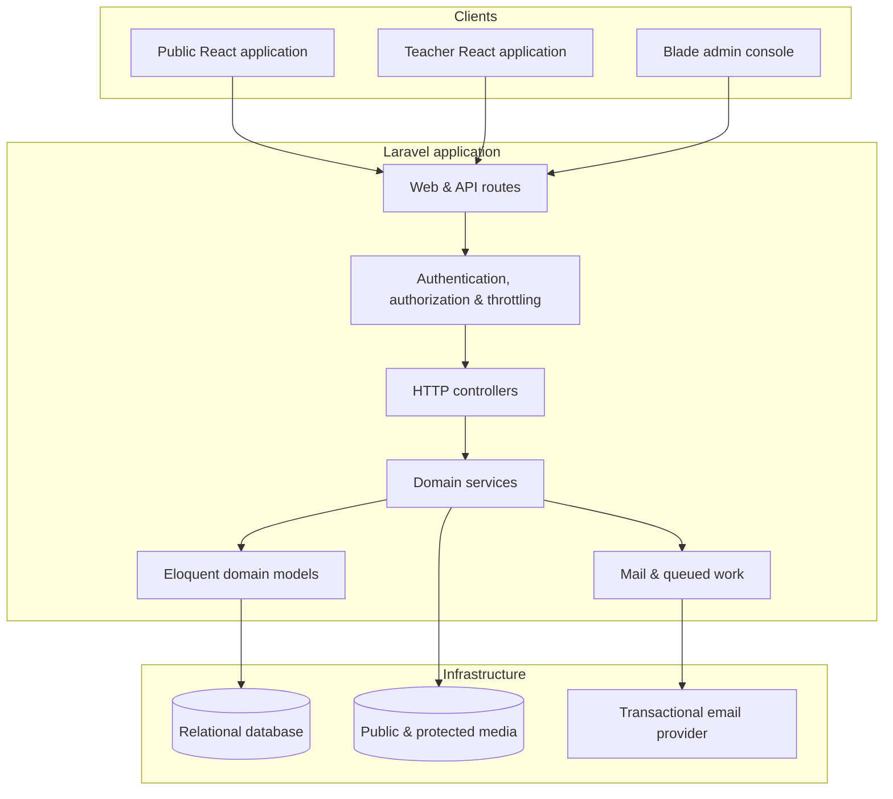

# Architecture

## Context

The platform serves three audiences with different interaction patterns:

- Visitors, families, and students use a responsive public experience for discovery, enrollment, bookings, and showcases.
- Teachers use a protected workspace optimized for recurring class operations.
- Administrators use a server-rendered console for broad content and operational management.

## Component view

## Design choices

### Hybrid frontend

Public and teacher experiences benefit from client-side navigation and interactive state, while administrative CRUD and reporting screens benefit from server-rendered forms. Keeping both approaches in one Laravel deployment avoids duplicating domain rules and authentication infrastructure.

### Domain-oriented API

Endpoints are grouped around content, enrollment, scheduling, teacher operations, bookings, and showcases. Validation remains on the server even when equivalent client-side validation improves the form experience.

### Controlled media access

Public marketing imagery and protected student media follow separate delivery paths. This allows access checks and response controls to be applied to sensitive project videos without complicating ordinary static assets.

### Workflow state over destructive updates

Bookings, enrollments, votes, and submissions retain explicit statuses. This supports review, moderation, follow-up, and troubleshooting more safely than immediately deleting or overwriting operational records.

## Key cross-cutting concerns

| Concern | Approach |
| --- | --- |
| Authentication | Separate role-aware entry points for admins, teachers, and public users |
| Abuse prevention | Rate limits on public submissions, authentication, and voting |
| Verification | Email/code verification for registration, reset, and showcase workflows |
| Content publishing | Draft/publish controls and centrally managed page content |
| SEO | Dynamic metadata, stable slugs, sitemap, and robots handling |
| Testability | Feature coverage around business flows plus unit/UI tests |
| Deployment | Environment-based configuration and deployment-specific public entry points |
