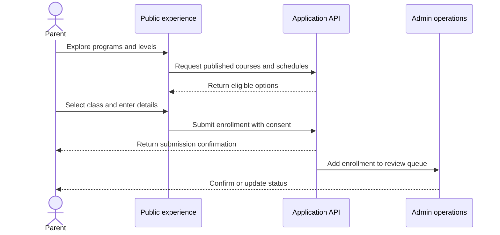
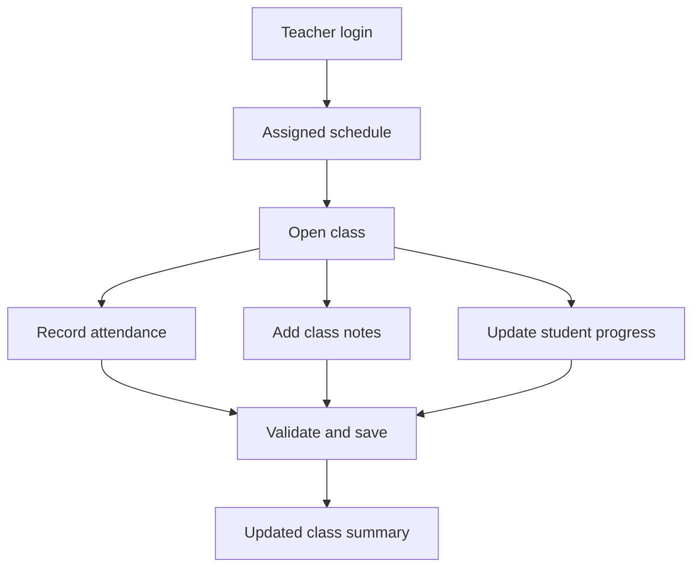
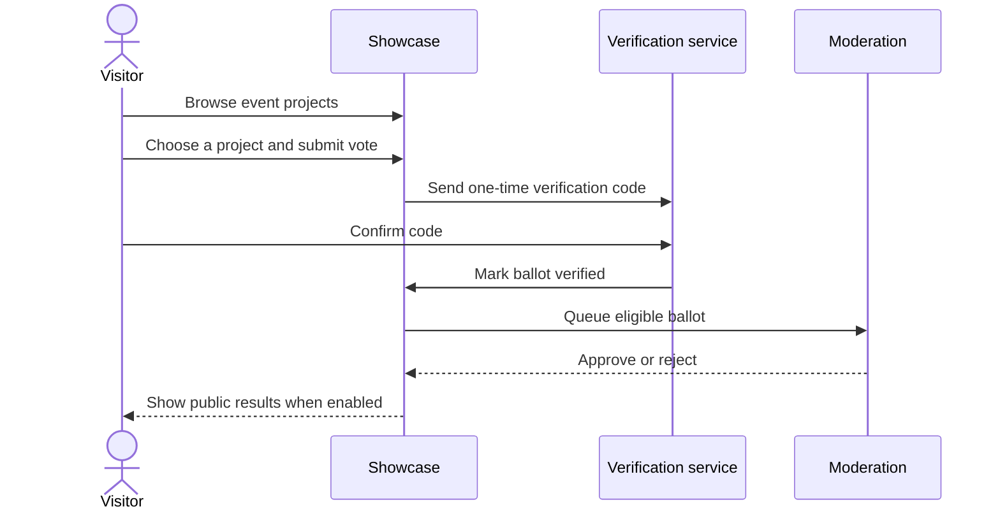

# User flows

## 1. Course enrollment

```mermaid
sequenceDiagram
    actor Parent
    participant Site as Public experience
    participant API as Application API
    participant Ops as Admin operations

    Parent->>Site: Explore programs and levels
    Site->>API: Request published courses and schedules
    API-->>Site: Return eligible options
    Parent->>Site: Select class and enter details
    Site->>API: Submit enrollment with consent
    API-->>Parent: Return submission confirmation
    API->>Ops: Add enrollment to review queue
    Ops-->>Parent: Confirm or update status
```

## 2. Teacher class operations

```mermaid
flowchart TD
    Login[Teacher login] --> Dashboard[Assigned schedule]
    Dashboard --> Class[Open class]
    Class --> Attendance[Record attendance]
    Class --> Notes[Add class notes]
    Class --> Progress[Update student progress]
    Attendance --> Save[Validate and save]
    Notes --> Save
    Progress --> Save
    Save --> Summary[Updated class summary]
```

## 3. Verified showcase voting

```mermaid
sequenceDiagram
    actor Visitor
    participant Showcase
    participant Verify as Verification service
    participant Review as Moderation

    Visitor->>Showcase: Browse event projects
    Visitor->>Showcase: Choose a project and submit vote
    Showcase->>Verify: Send one-time verification code
    Visitor->>Verify: Confirm code
    Verify->>Showcase: Mark ballot verified
    Showcase->>Review: Queue eligible ballot
    Review-->>Showcase: Approve or reject
    Showcase-->>Visitor: Show public results when enabled
```

## 4. Camp registration

```mermaid
flowchart LR
    Sessions[Browse available sessions] --> Cart[Select one or more weeks]
    Cart --> Details[Parent and camper details]
    Details --> Medical[Required care information]
    Medical --> Policies[Policy acknowledgements]
    Policies --> Review[Review registration]
    Review --> Submit[Submit request]
    Submit --> Reference[Receive confirmation reference]
    Reference --> Followup[Staff availability and payment follow-up]
```
