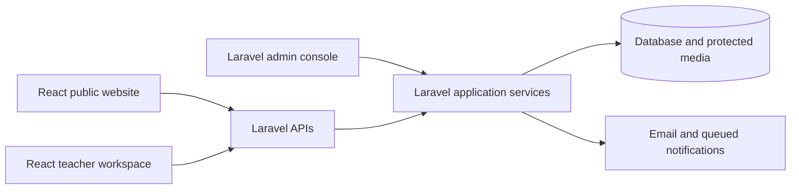
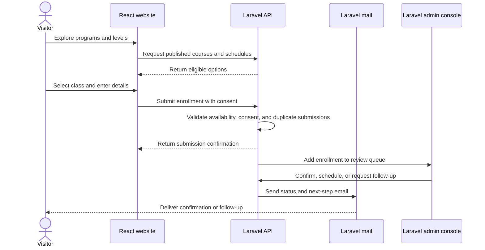
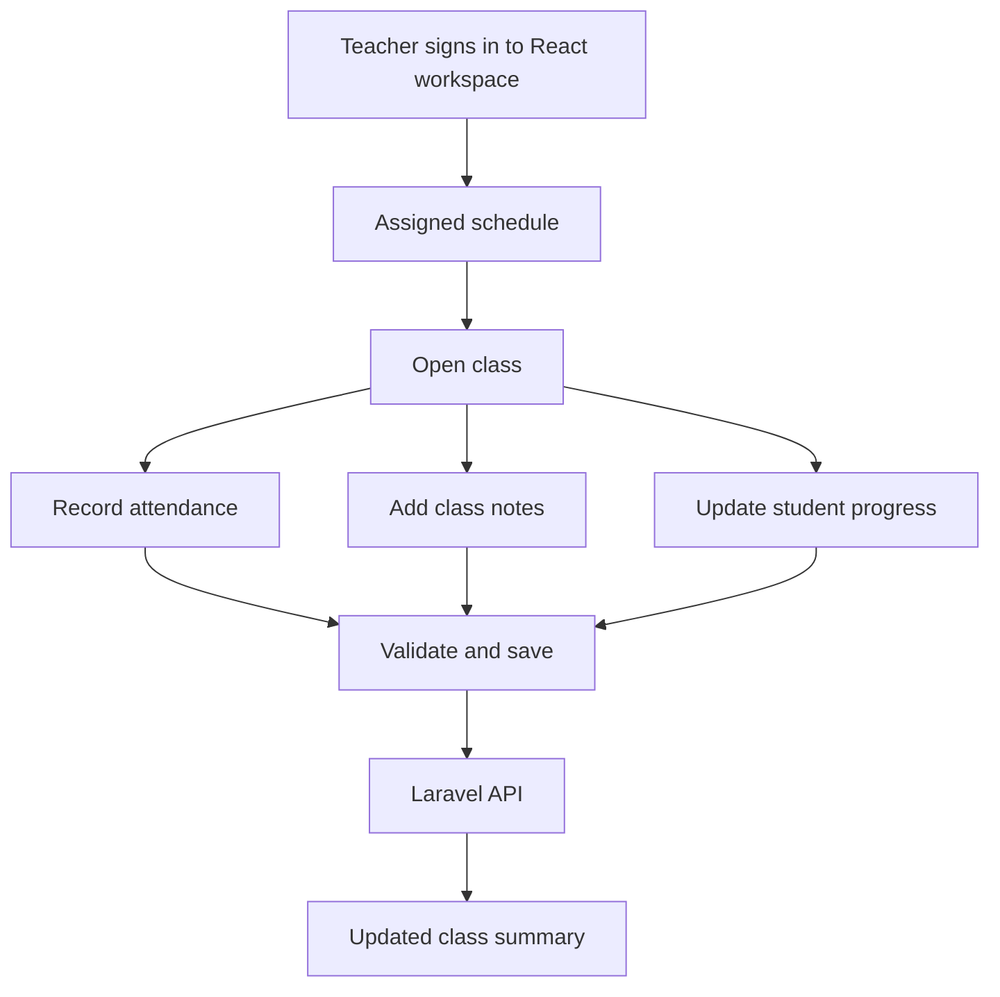
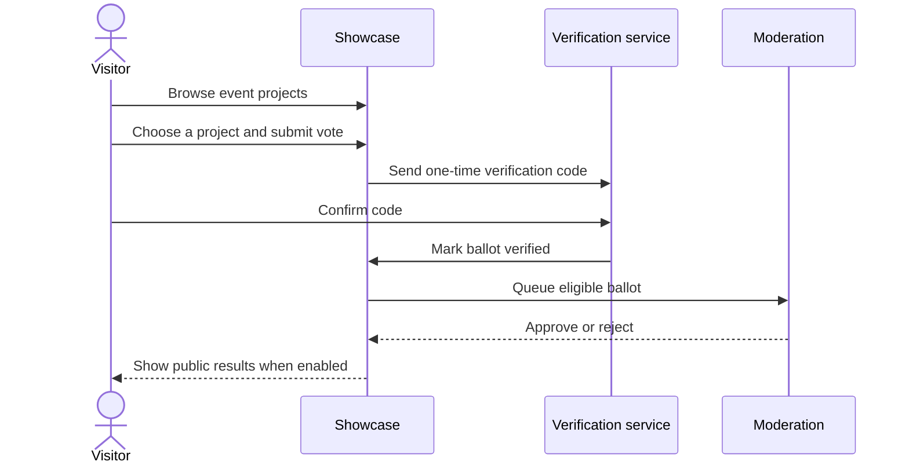

# User flows

## Platform boundary

The public website and teacher workspace are React clients. Laravel APIs own validation, authorization, domain rules, email, media, and persistence; the Laravel admin console gives operations staff a controlled interface over the same application services.

## 1. Course enrollment

## 2. Teacher class operations

## 3. Verified showcase voting

## 4. Camp registration

```mermaid
flowchart LR
    Sessions[Browse available sessions] --> Cart[Select one or more weeks]
    Cart --> Details[Contact and camper details]
    Details --> Medical[Required care information]
    Medical --> Policies[Policy acknowledgements]
    Policies --> Review[Review registration]
    Review --> Submit[Submit request]
    Submit --> Reference[Receive confirmation reference]
    Reference --> Followup[Staff availability and payment follow-up]
```

